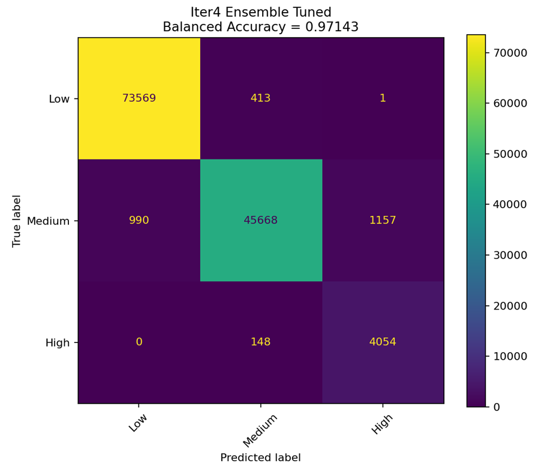

# Irrigation Need Prediction — Kaggle ML Assignment

<div align="center">


**A machine learning pipeline for predicting irrigation need as Low, Medium, or High using agricultural, soil, weather, and crop-related features.**

</div>

---

## Overview

This repository contains the final code and report files for **Assignment 3: Machine Learning**, based on the Kaggle competition **Playground Series - Season 6, Episode 4: Predicting Irrigation Need**.

The task is a **multiclass classification problem**. Given field and environmental data, the model predicts the target variable:

```text
Irrigation_Need
```

The possible output classes are:

```text
Low
Medium
High
```

The competition uses **balanced accuracy** as the evaluation metric, which is important because the dataset is imbalanced and the `High` class has fewer samples than the other classes.

---

## Final Result

| Item | Result |
|------|--------|
| **Best submission file** | `submission_iter4_high_plus_12.csv` |
| **Best Kaggle score** | `0.96933` |
| **Best model approach** | HistGradientBoosting ensemble + feature engineering + class probability adjustment |
| **Final source file** | `ass3_solution_iter4_ensemble_safe.py` |

---

## Repository Structure

```text
Ass3_Kaggle/
├── ass3_solution_iter4_ensemble_safe.py   # Final Python source file
├── submission_iter4_high_plus_12.csv      # Best final Kaggle submission
├── Ass3_Kaggle_Final_Iteration_Report.docx # Final assignment report
├── README.md                              # Project documentation
├── requirements.txt                       # Python dependencies
├── screenshots/                           # Optional screenshots for report/GitHub
│   ├── leaderboard.png                    # Kaggle leaderboard screenshot
│   └── final_confusion_matrix.png          # Final model confusion matrix
├── outputs_iter4_ensemble/                # Final model outputs
│   ├── submission_iter4_high_plus_12.csv
│   ├── submission_iter4_ensemble.csv
│   └── confusion_matrix_final.png
└── .gitignore
```

> Note: The `venv/` folder should **not** be uploaded to GitHub. It can be recreated later using the instructions below.

---

## Dataset Files

The project uses the following Kaggle competition files:

```text
train.csv
 test.csv
 sample_submission.csv
```

Expected columns include soil, crop, season, irrigation, weather, and field information such as:

```text
Soil_Type
Soil_pH
Soil_Moisture
Organic_Carbon
Electrical_Conductivity
Temperature_C
Humidity
Rainfall_mm
Sunlight_Hours
Wind_Speed_kmh
Crop_Type
Crop_Growth_Stage
Season
Irrigation_Type
Water_Source
Field_Area_hectare
Mulching_Used
Previous_Irrigation_mm
Region
```

The target column in `train.csv` is:

```text
Irrigation_Need
```

---

## Features

| Feature | Detail |
|---------|--------|
| **Problem type** | Multiclass classification |
| **Target classes** | Low, Medium, High |
| **Evaluation metric** | Balanced accuracy |
| **Preprocessing** | Categorical encoding, numeric handling, feature engineering |
| **Validation** | Train-validation split and model comparison |
| **Models tested** | Decision Tree, Naive Bayes, K-Means, Logistic Regression, HistGradientBoosting |
| **Final model** | Ensemble of tuned HistGradientBoosting classifiers |
| **Imbalance handling** | Class balancing and probability adjustment for the minority `High` class |
| **Output** | Kaggle-compatible CSV submission file |

---

## Models Attempted

The assignment required trying multiple machine learning methods. The following models were tested:

| Model | Purpose / Observation |
|------|------------------------|
| **Decision Tree** | Strong baseline model, but can overfit on training data |
| **Naive Bayes** | Fast and simple, but weaker due to feature independence assumptions |
| **K-Means as Classifier** | Poor performance because it is unsupervised and does not learn class labels directly |
| **Logistic Regression** | Better than Naive Bayes and K-Means, but limited for nonlinear relationships |
| **HistGradientBoosting** | Stronger tree-based model that captured nonlinear patterns well |
| **Final Ensemble** | Combined tuned HistGradientBoosting models and class probability adjustment |

---

## Iteration Summary

| Iteration | Main Approach | Result / Insight |
|----------|---------------|------------------|
| **Iteration 1** | Baseline models including Decision Tree, Naive Bayes, K-Means, Logistic Regression, HistGradientBoosting | Created first working Kaggle submission and confusion matrices |
| **Iteration 2** | Tuned HistGradientBoosting model | Improved Kaggle position compared to baseline |
| **Iteration 3** | More feature engineering and probability tuning | Further improvement; `submission_more_high.csv` performed better |
| **Iteration 4** | HistGradientBoosting ensemble with stronger class adjustment | Best result: `0.96933` using `submission_iter4_high_plus_12.csv` |

---

## Installation

### 1. Clone the repository

```bash
git clone <your-repository-link>
cd Ass3_Kaggle
```

### 2. Create a virtual environment

```bash
python3 -m venv venv
```

### 3. Activate the virtual environment

On Linux/macOS:

```bash
source venv/bin/activate
```

On Windows:

```bash
venv\Scripts\activate
```

### 4. Install dependencies

```bash
pip install -r requirements.txt
```

If `requirements.txt` is not available, install the main packages manually:

```bash
pip install pandas numpy scikit-learn matplotlib
```

---

## How to Run

Place the Kaggle data files in the project folder:

```text
train.csv
test.csv
sample_submission.csv
```

Then run the final script:

```bash
python ass3_solution_iter4_ensemble_safe.py
```

The script will generate output files inside the output directory, including Kaggle submission files.

---

## Kaggle Submission

The final selected submission file is:

```text
submission_iter4_high_plus_12.csv
```

The submission format is:

```csv
id,Irrigation_Need
630000,Low
630001,High
630002,Medium
```

Upload this CSV file to Kaggle using the **Submit Predictions** button on the competition page.

---

## Output Files

The script produces files such as:

```text
outputs_iter4_ensemble/submission_iter4_ensemble.csv
outputs_iter4_ensemble/submission_iter4_high_plus_12.csv
outputs_iter4_ensemble/confusion_matrix_final.png
```

Important files for assignment submission:

| File | Purpose |
|------|---------|
| `ass3_solution_iter4_ensemble_safe.py` | Final Python source code |
| `submission_iter4_high_plus_12.csv` | Final Kaggle prediction file |
| `Ass3_Kaggle_Final_Iteration_Report.docx` | Final report |
| `leaderboard.png` | Kaggle screenshot showing score/rank |

---

## Screenshots

Add your screenshots in a `screenshots/` folder.

<p align="center">
  
  <br><b>Kaggle Leaderboard Score</b>
</p>

<p align="center">
  
  <br><b>Final Model Confusion Matrix</b>
</p>

---

## How the Final Model Works

The final model uses an ensemble of HistGradientBoosting classifiers.

The workflow is:

```text
Load train/test data
→ preprocess features
→ engineer additional useful features
→ train multiple models
→ evaluate using balanced accuracy
→ tune class probabilities
→ generate Kaggle submission CSV
```

### Why Balanced Accuracy?

The dataset is imbalanced. The `Low` and `Medium` classes have many more samples than the `High` class. Normal accuracy can look high even if the model performs poorly on the minority class. Balanced accuracy gives equal importance to each class, so it is better for this task.

### Why Probability Adjustment?

The `High` class is the minority class. Probability adjustment helped the final model become more sensitive to `High`, which improved the Kaggle score.

---

## Assignment Submission Checklist

Submit the following files:

- [x] Final Python source file: `ass3_solution_iter4_ensemble_safe.py`
- [x] Final Kaggle CSV: `submission_iter4_high_plus_12.csv`
- [x] Kaggle leaderboard screenshot
- [x] Final report: `Ass3_Kaggle_Final_Iteration_Report.docx`

---

## .gitignore Recommendation

Use this `.gitignore` to avoid uploading unnecessary files:

```gitignore
venv/
__pycache__/
*.pyc
.ipynb_checkpoints/
outputs/
*.pkl
*.joblib
.DS_Store
```

If you want to keep final outputs on GitHub, remove `outputs/` from `.gitignore` and only upload the important files.

---

## Future Improvements

- [ ] Try XGBoost or LightGBM for stronger leaderboard performance
- [ ] Perform more hyperparameter tuning
- [ ] Add automated feature selection
- [ ] Use more robust cross-validation for final model comparison
- [ ] Save model artifacts using `joblib`
- [ ] Add a notebook version for easier explanation and presentation

---

## Author

**Name:** Sharjeel Memon  
**Course:** Artificial Intelligence  
**Assignment:** Machine Learning Kaggle Competition  
**Topic:** Predicting Irrigation Need

---

## License

This repository is for academic coursework and learning purposes.
